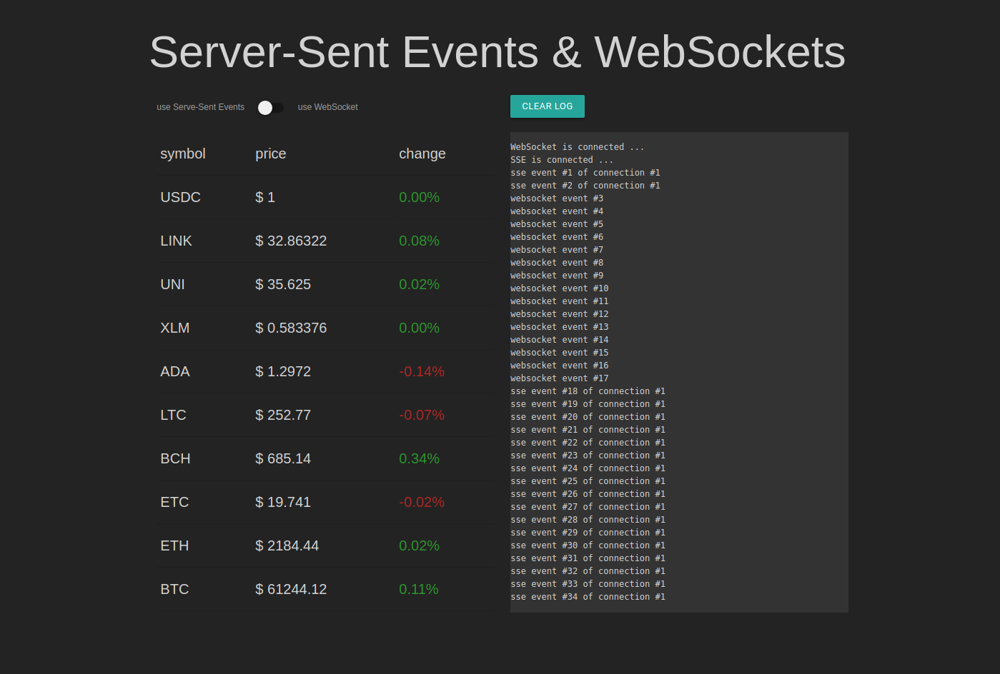

# Server-Sent Events w/ crypto price ticks

This is a simple demonstration of Server-Sent Events & WebSockets based on a Node.js backend and a HTML/JS frontend.

[Server-Sent events](https://developer.mozilla.org/en-US/docs/Server-sent_events/Using_server-sent_events) (SSE) is a specification for implementing server-side push events to web frontend applications, through plain-old HTTP.

This is best contrasted with [WebSockets](https://developer.mozilla.org/en/docs/WebSockets), which offer a full-duplex messaging channel over a custom protocol, operating within a single TCP connection w/ an HTTP-compatible handshake.

## Setup

clone the project and perform the following commands
```
npm install 
node server.js
```

## Trying out the demo

Navigate to http://localhost:8000 and watch crypto rise 🚀🚀🚀 



On this page you have the opportunity to switch between SSE and WebSockets for ticker events. It will do the same thing, but with the two different technologies.

* for SSE the client opens a connection to `/events` endpoint, which the server keeps open
* for WebSockets, a connection to `http://localhost:40510` is used

## SSE vs WebSockets

### Advantages of SSE:

* Transported over simple HTTP instead of a custom protocol
* Can be poly-filled with javascript to "backport" SSE to browsers that do not support it yet.
* Built in support for re-connection and event-id
   * try restarting our Node.js server. 
   * when using SSE, the tick events will work great again
   * with the switch set to WebSockets, thats not the case
* No trouble with corporate firewalls doing packet inspection
* Ideally used for stock ticker or browser notifications

### Advantages of WebSockets:

* Real time, two directional communication.
* Native support in more browsers
* Supports binary data as well
* No connection limit
   * SSE is limited to 6 connections per browser + domain
* Ideally used for chat applications


~💎👐💎~